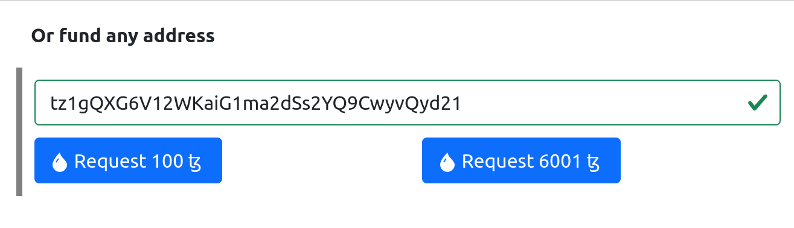
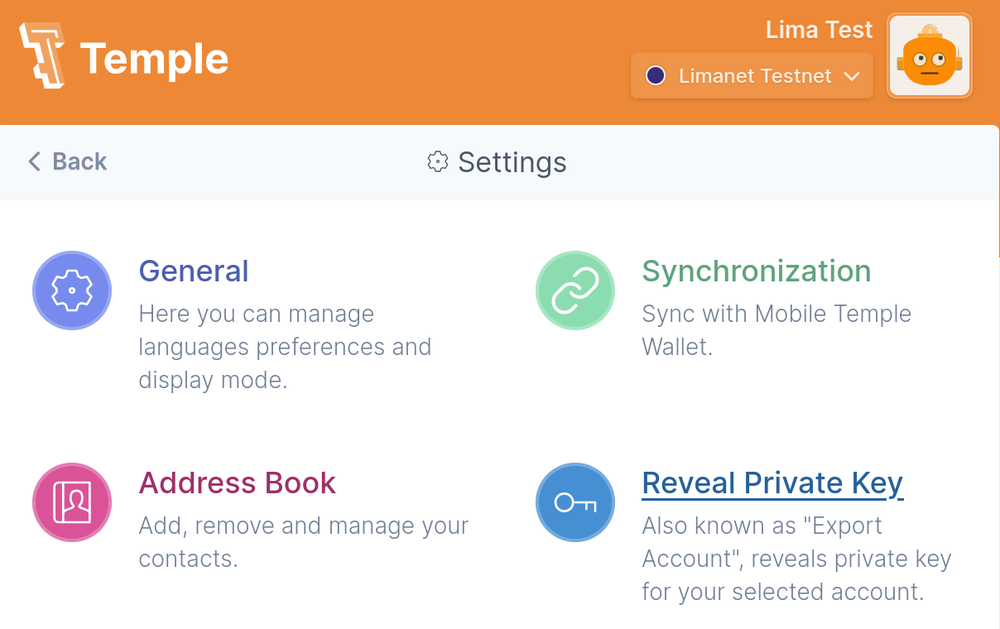

# Setup a Lima env

## Configuration of Limanet

```
octez-node config init   --network limanet   --data-dir ~/.tezos-node-limanet
```

## Import snapshot
Download a snap-shot at `https://snapshots.tezos.marigold.dev/`

```
octez-node snapshot import 2022.12.23_TEZOS_LIMANET_2022-10-13T15\ 00\ 00Z-BMeGzGtMAis2JMiEzKLVqG86vLZFXSU8F4mvFSFRtpQhSuBczBY-380589.rolling --data-dir ~/.tezos-node-limanet
```

## Launch node
```
octez-node run   --network limanet   --data-dir ~/.tezos-node-limanet   --synchronisation-threshold 1   --rpc-addr localhost:8732
```
The node should synchronize


## Create a faucet
Visit the website `https://faucet.limanet.teztnets.xyz/` and fill your Tezos address




## Retrieve your private key (edsk....)
In your temple wallet, select `Settings` and choose the Reveal Private Key

You will get your private key


## Register your account
```
octez-client import secret key me unencrypted:edsk...
```

## Verify account
```
octez-client list known addresses
octez-client get balance for me
```


